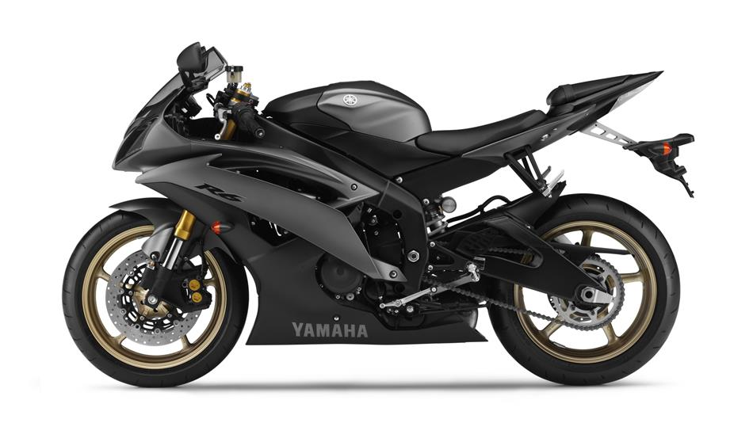

= Groovy Inline Macro

#Sample document to show extension for Asciidoctor written in Groovy.

With the twitter macro we can create links 

== Tasks

* Presentation
* Demo

:source-highlighter: coderay

[source,java]
----
System.out.println("test code");
----

<1> Print test code to the console

== Engine

* Presentation
* Demo

[source,java]
----
System.out.println("engine code");
----

== Type checking assignments

An object o of type A can be assigned to a variable of type T if and only if:

* `T` equals `A`

+

[.result]
====
[source,groovy]
----
Date now = new Date()
----
====

* or `T` is one of `String`, `boolean`, `Boolean` or `Class`

IMPORTANT: Don't forget...

WARNING: Watch out for...

CAUTION: Ensure that...

NOTE: For you info

== Level 1 Section Title

=== Level 2 Section Title

==== Level 3 Section Title

===== Level 4 Section Title

====== Level 5 Section Title

== Another Level 1 Section Title

[options=interactive]
- [*] checked
- [x] also checked
- [ ] not checked
-     normal list item

CPU:: The brain of the computer.
Hard drive:: Permanent storage for operating system and/or user files.
RAM:: Temporarily stores information the CPU uses during operation.
Keyboard:: Used to enter text or control items on the screen.
Mouse:: Used to point to and select items on your computer screen.
Monitor:: Displays information in visual form using text and graphics

[horizontal]
CPU:: The brain of the computer.
Hard drive:: Permanent storage for operating system and/or user files.
RAM:: Temporarily stores information the CPU uses during operation.

Operating Systems::
  Linux:::
    . Fedora
      * Desktop
    . Ubuntu
      * Desktop
      * Server
  BSD:::
    . FreeBSD
    . NetBSD

Cloud Providers::
  PaaS:::
    . OpenShift
    . CloudBees
  IaaS:::
    . Amazon EC2
    . Rackspace
    
    
,===
Artist,Track,Genre

Baauer,Harlem Shake,Hip Hop
,===

[[yamaha]]
.This image represents a yamaha bike

If you are reporting a bug, please help to speed up problem diagnosis by providing as much
information as possible. Ideally, that would include a small
https://github.com/spring-projects/spring-boot-issues[sample project] that reproduces the
problem

[source,java]
.Java code from project
----
include::{sourcedir}/pl/java/scalatech/annotation/SecurityComponent.java[tags=contains,indent=0]
----

ifndef::sourcedir[:sourcedir: ../src/main/java/]

== Attributes

.Built-in
asciidoctor-version:: {asciidoctor-version}
safe-mode-name:: {safe-mode-name}
docdir:: {docdir}
docfile:: {docfile}
imagesdir:: {imagesdir}

.Custom
sourcedir:: {sourcedir}

== Diagrams

You can make http://asciidoctor.org/docs/asciidoctor-diagram/[diagrams in Asciidoctor]

For example, the following:

== build.gradle

[source,groovy]
----
include::{build-gradle}[]
----

== java
[source,java]
----
include::{sourcedir}/pl/java/scalatech/BootRest.java[]
----

[ditaa]
....
                   +-------------+
                   | Asciidoctor |-------+
                   |   diagram   |       |
                   +-------------+       | PNG out
                       ^                 |
                       | ditaa in        |
                       |                 v
 +--------+   +--------+----+    /---------------\
 |        | --+ Asciidoctor +--> |               |
 |  Text  |   +-------------+    |   Beautiful   |
 |Document|   |   !magic!   |    |    Output     |
 |     {d}|   |             |    |               |
 +---+----+   +-------------+    \---------------/
     :                                   ^
     |          Lots of work             |
     +-----------------------------------+
....

[graphviz, "dot_example", "svg"]
----
graph ethane {
     C_0 -- H_0 [type=s];
     C_0 -- H_1 [type=s];
     C_0 -- H_2 [type=s];
     C_0 -- C_1 [type=s];
     C_1 -- H_3 [type=s];
     C_1 -- H_4 [type=s];
     C_1 -- H_5 [type=s];
}
----

[plantuml, diagram-classes, png]     
....
class BlockProcessor
class DiagramBlock
class DitaaBlock
class PlantUmlBlock
class SlawekUmlBlock

BlockProcessor <|-- DiagramBlock
DiagramBlock <|-- DitaaBlock
DiagramBlock <|-- PlantUmlBlock
PlantUmlBlock <|-- SlawekUmlBlock

